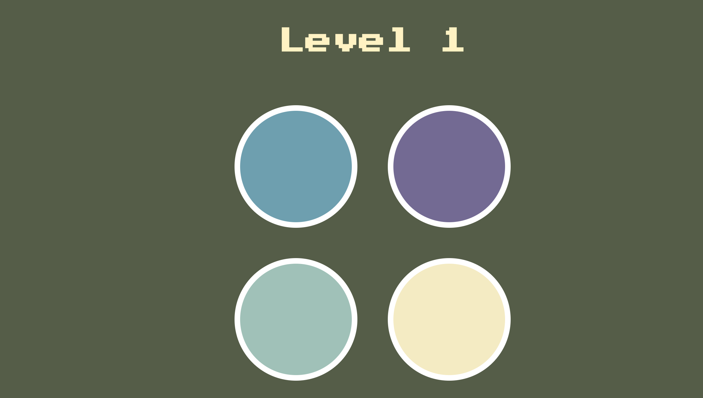

# Simon-Game Description
Inspired by the vintage 1978 Hasbro's Simon Game, a memory skill game. Players will have to remember the sequences of colours that appears on the screen, and have to "play back" the exact order of these colours. If they get one colour in the sequence incorrect, they will have to restart at level 0.

### Purpose
This is my first JavaScript game and although simplistic, I did learn a lot from this project, including being familiar with the jQuery library. Hopefully, more JavaScript projects are to come.
